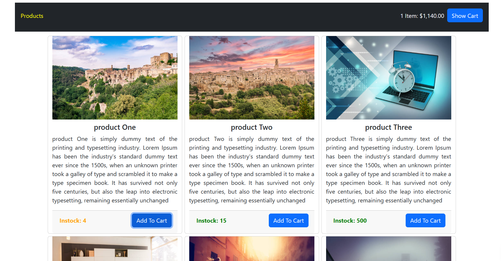
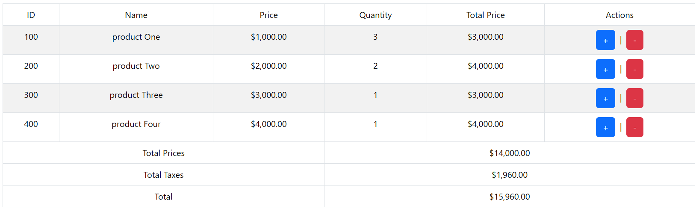

# Online Shopping

## 📖 Project Description

a simple and stylish e-commerce application built with Vue.js and Bootstrap. This project allows users to browse products, add them to a cart and adjust quantities.

## 🚀 Features

- Elegant Product Display: View products with high-quality images, descriptions, and stock availability.

- Add to Cart: Easily add products with a single click.

- Adjust Quantities: Increase or decrease item quantities.

- Cart Overview: View selected items along with total price and quantity.

- Responsive Design: Fully optimized for mobile, tablet, and desktop screens.

## 🛠️ Technologies Used

- Vue.js.

- Bootstrap.

- JavaScript.

- HTML & CSS.

## 📸 Screenshots

Here are some screenshots of the project.

The products page:

The cart page:

## 📥 Installation

// Clone the repository
git clone https://github.com/rafatgom3a/vue-online-shopping.git

// Navigate to the project directory
cd vue-online-shopping

// Install dependencies
npm install

// Start the development server
npm run serve
